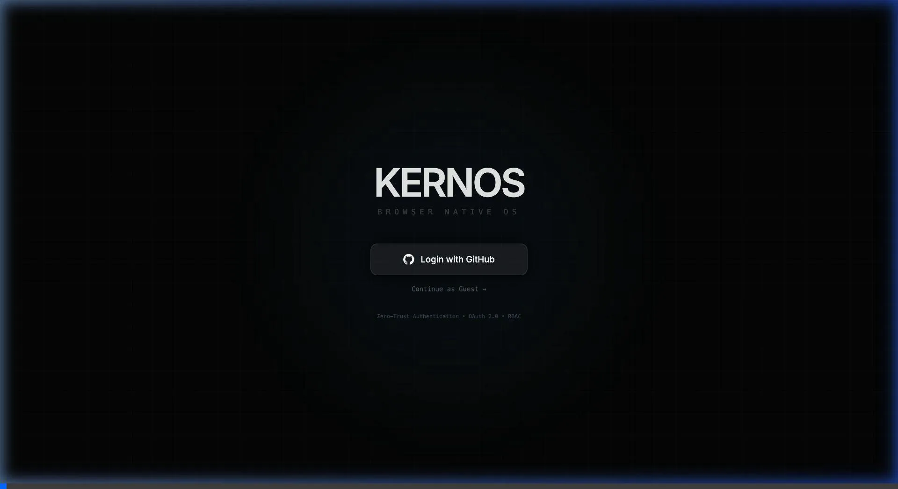

<div align="center">

# 🧠 Kernos OS

**The Cognitive Microkernel & Autonomous Operating System**

[](https://go.dev)
[](https://react.dev)
[](LICENSE)

*The world's first operating system where AI agents are kernel-level citizens — not applications.*

> **Why "Kernos"?**  
> In ancient Greek antiquity, a *kernos* was a unique pottery vessel featuring a central base with multiple distinct, isolated cups attached to it. It perfectly represents this OS's architecture: a central, high-speed Go **microkernel** acting as the foundation, holding multiple isolated, autonomous AI **agents** and sandboxes that operate together as a single cognitive entity.

</div>

<br />

<div align="center">
  
</div>

<br />

---

## 🧬 Core Architecture: The "Unconventional Trinity"

Kernos OS discards traditional Unix and Windows paradigms. Instead of treating AI as an external application, Kernos wires cognitive routing directly into the Kernel Space:

### 1. Vector Graph Memory
A traditional OS organizes memory via a hierarchical file system tree. Kernos replaces this with a mathematical **Vector Graph**. Keystrokes, file contents, and system outputs are mapped into a localized Nomic 768-dimensional latent space. The kernel retrieves contextual data by semantic resonance, rather than exact path matching.

### 2. Speculative RAG Execution
Kernos utilizes local LLMs for **Speculative Execution**. The OS evaluates partial terminal input, predicts the most likely complete command, and silently pre-executes it in an invisible sandbox jail. When the user submits the command, the OS yields the pre-computed `stdout` with perceived zero-latency.

### 3. Concurrent DAG Mutation
Traditional shell scripts run sequentially and fail abruptly. Kernos executes multi-step objectives using **Directed Acyclic Graphs (DAGs)**. If a node fails during execution, the "Architect" agent synthesizes multiple divergent recovery paths. The engine executes these alternative branches in parallel; the first to exit successfully collapses the state and is grafted back into the DAG.

---

## ⚡ The Neuroplasticity Engine

**A novel, real-time concurrent learning system** — the first of its kind at the OS kernel level.

While the existing Synaptic Consolidation runs nightly (the "sleep state"), the Neuroplasticity Engine processes learning signals in **real-time** using Go's concurrency primitives (the "awake state"):

| Pipeline | Workers | What It Does |
|---|---|---|
| **Reward Signals** | 4 goroutines | Scores every agent response and task execution, generates micro-rules for strongly positive/negative interactions |
| **Error Pattern Recognition** | 2 goroutines | Classifies terminal errors into categories. When the same error class occurs 3+ times, synthesizes a preventive micro-rule |
| **Embedding Ingestion** | 3 goroutines | Continuously indexes conversations and terminal outputs into Vector Memory, keeping the semantic graph fresh |

Micro-rules are flushed to disk every 5 minutes and injected into all agent prompts. The nightly consolidation handles compression and deduplication.

---

## 🤖 Multi-Agent Architecture (6 Agents, 2 Models)

Kernos runs **6 specialized AI agents** as kernel-level goroutines — all using just **2 local LLM models** via LM Studio. Each agent has a unique role defined by its system prompt, not by its model:

| Agent | Model | Role |
|---|---|---|
| **Dispatcher** | Qwen-VL-4B | Fast triage — converts requests to DAGs, handles multimodal (text + image) |
| **Architect** | Qwen-Thinking | Deep review — validates DAGs, synthesizes recovery paths, provides second opinions |
| **Kernos Assistant** | Qwen-Thinking | Conversational AI — multi-turn chat with 10-turn sliding context window |
| **DevOps Engineer** | Qwen-Thinking | Infrastructure specialist — deployment, CI/CD, system administration |
| **Security Auditor** | Qwen-Thinking | Vulnerability detection — code security review, threat modeling |
| **Code Review** | Qwen-VL-4B | Code quality — identifies bugs, performance issues, and best practices |

### Agent-to-Agent Communication
Agents communicate autonomously via the `agent.internal` bus topic. When an agent produces a low-confidence response (< 0.5), it automatically delegates to the Architect for a second opinion — no human intervention required.

### Proactive Initiative
The Dispatcher monitors terminal output in real-time. When it detects errors (`panic:`, `build failed`, `module not found`, etc.), it proactively generates a fix suggestion and pushes it to the UI.

---

## ✨ Complete Subsystem Map

| Subsystem | Implementation |
|---|---|
| 🧠 **Neuroplasticity Engine** | Real-time concurrent learning via 3 Go channel pipelines (9 worker goroutines) |
| 🤖 **6 Embedded Agents** | Specialist AI agents as kernel goroutines with agent-to-agent delegation |
| 👻 **Speculative Execution** | Predict → Shadow Execute → 0ms cache hit on terminal commands |
| 🧬 **Self-Healing DAGs** | Quantum parallel race-condition mutation on task failure |
| 🎯 **Autonomous ReAct Loop** | Abstract goal → 10-step autonomous command execution |
| 💬 **Conversational AI** | Multi-turn chat with 10-turn sliding context window |
| 🔍 **Confidence Scoring** | Heuristic self-assessment with automatic second opinion |
| 📦 **Package Manager** | 9 real packages with install/uninstall, OS/arch detection, installed state persistence |
| 🧠 **Vector Memory** | Nomic 768-dim embeddings with semantic search and weight decay |
| 🌙 **RLHF Consolidation** | Nightly contrastive reinforcement with synaptic weight compression |
| 🔮 **Hallucinatory RAG** | Sensory Cortex pre-warms semantic cache from predicted future context |
| 🖼️ **VL Image Analysis** | Multimodal base64 image → Qwen-VL visual analysis |
| 🛡️ **WASM Applets** | React components compiled into sandboxed WebAssembly containers |
| 🌐 **P2P WebRTC** | Peer-to-peer data channels for distributed kernel communication |
| ⏪ **Temporal Branching** | Immutable timeline of all system state mutations |
| 🔐 **Auth** | Google/GitHub OAuth + guest fallback + JWT sessions |

---

## 📦 Package Manager

The Kernos Package Manager downloads real binaries from GitHub releases and official CDNs, with automatic OS/architecture detection:

| Package | Version | macOS ARM64 | macOS x86 | Linux x64 |
|---|---|---|---|---|
| Python | 3.12.2 | ✅ | ✅ | ✅ |
| Node.js | 20.11.1 | ✅ | ✅ | ✅ |
| Go | 1.22.0 | ✅ | ✅ | ✅ |
| Rust | 1.76.0 | ✅ | ✅ | ✅ |
| Deno | 1.40.5 | ✅ | ✅ | ✅ |
| FFmpeg | 6.0.0 | ✅ | ✅ | ✅ |
| SQLite | 0.21.6 | ✅ | ✅ | ✅ |
| ripgrep | 14.1.0 | ✅ | ✅ | ✅ |
| jq | 1.7.1 | ✅ | ✅ | ✅ |

---

## 🚀 Installation

The entire Operating System — the Go microkernel, the React graphical environment, the Nomic vector database, and the WebSocket Bus — compiles into a **single binary** with zero external dependencies.

### 1. LM Studio Setup (Required for AI)

1. Download and install **[LM Studio](https://lmstudio.ai/)**
2. Download these models:
   - `qwen/qwen3-vl-4b` — Multimodal vision-language model
   - `qwen/qwen3-4b-thinking-2507` — Deep reasoning model
   - `text-embedding-nomic-embed-text-v1.5` — Vector embeddings
3. Start the **Local Server** on `http://localhost:1234/v1`

> **Alternative Models:** Update the `model` strings in `server/agents.yaml` to match your preferred models.

### 2. Build & Run

```bash
git clone https://github.com/GI-Company/kernos-os.git
cd kernos-os

# Install frontend dependencies
npm install

# Build the Go microkernel
cd server
go build -o kernos_server

# Start the kernel
./kernos_server -lm-url http://localhost:1234/v1/chat/completions
```

Open **http://localhost:8080** in your browser.

---

## 🏗️ Envelope Protocol

Kernos communicates exclusively via typed **Envelope** messages across a high-performance pub-sub bus:

```typescript
interface Envelope {
  topic: string;     // e.g., "agent.chat", "task.run", "neuro.learn"
  from: string;      // The sender (agent ID, "kernel", "ui")
  to?: string;       // Direct routing target
  payload: any;      // The dynamic payload
  time: string;      // ISO 8601 timestamp
}
```

Every agent, every UI component, every terminal command, and every learning signal flows through this single nervous system. Nothing is hidden. Everything is observable.

---

## 📚 Documentation

- [Research Paper](./KERNOS_OS_RESEARCH_PAPER.md) — Formal academic exploration of the Cognitive Microkernel framework
- [Whitepaper](./KERNOS_OS_WHITEPAPER.md) — Deep dive into kernel architecture and intelligent subsystems
- [Commercial Analysis](./KERNOS_OS_VALUATION.md) — Market viability and technical review

---

## 📜 License

Apache 2.0 — Open Source Cognitive Computing.
