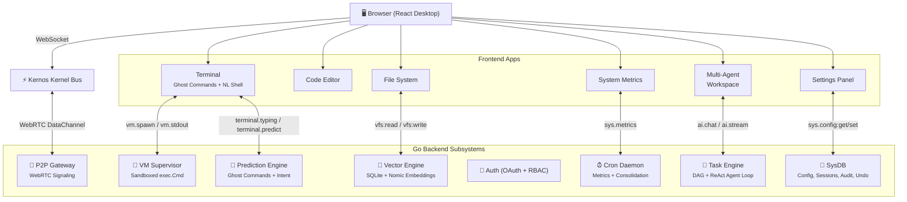

<div align="center">

# 🧠 Kernos OS

**The AI-Native Browser Operating System**

[](https://go.dev)
[](https://react.dev)
[](LICENSE)
[](https://github.com/GI-Company/kernos-os/actions)

*A full desktop environment in your browser — with AI agents wired into the kernel, not bolted on as chatbots.*

</div>

---

## ✨ What Makes Kernos Different

| Feature | Description |
|---|---|
| 🤖 **Ghost Commands** | Terminal predicts your next command in real-time — press Tab to accept |
| 💬 **Natural Language Shell** | Type `? show me big files` and the AI translates it to `find . -size +100M` |
| 🎯 **Autonomous Agent Loop** | Give the AI a goal like "set up a Node project" — it plans and executes automatically |
| 👥 **Multi-Agent Workspace** | 4 specialized AI agents (Security, Code Review, DevOps, Architect) collaborate on shared goals |
| 📡 **P2P Collaboration** | Bridge two Kernos instances over WebRTC with a 4-digit PIN — zero infrastructure needed |
| ⚡ **Speculative Execution** | Shadow engine pre-executes your commands as you type for 0ms latency responses |
| 🔒 **Zero-Trust Security** | Hardened sandbox, GitHub OAuth + RBAC, 30s timeout, env-stripped execution jail |
| 📊 **Live System Metrics** | Real-time dashboard showing heap, goroutines, WebSocket clients, and active processes |
| ⏪ **Persistent Undo** | Every config change is snapshotted — revert any setting to its previous state |
| 🔌 **Plugin System** | Drop a YAML file in `~/.kernos/plugins.yaml` to extend the OS with custom applets |

---

## 🚀 Quick Start

### Prerequisites
- **Go 1.23+** — [install](https://go.dev/dl/)
- **Node.js 22+** — [install](https://nodejs.org/)
- **LM Studio** *(optional, for AI features)* — [download](https://lmstudio.ai/)

### Run Locally

```bash
# Clone
git clone https://github.com/GI-Company/kernos-os.git
cd kernos-os

# Install frontend dependencies
npm install

# Start both frontend + backend
make dev
```

Open **http://localhost:3000** in your browser.

> **💡 Tip:** To enable AI features (Ghost Commands, Natural Language Shell, Autonomous Agents), start [LM Studio](https://lmstudio.ai/) with any model and pass the URL:
> ```bash
> cd server && go run . -lm-url http://localhost:1234/v1/chat/completions
> ```

### Docker (Zero Dependencies)

```bash
docker build -t kernos .
docker run -p 8080:8080 kernos
```

Open **http://localhost:8080**.

---

## 🏗️ Architecture

Kernos implements a **Split-Kernel Architecture**: the React UI and Go backend communicate exclusively through typed JSON `Envelope` messages over a WebSocket bus.



### The Envelope Protocol

Every message in Kernos uses a single universal format:

```typescript
interface Envelope {
  topic: string;     // e.g. "vm.spawn", "ai.chat", "sys.metrics"
  from: string;      // sender ID
  to?: string;       // optional target (for P2P routing)
  payload: any;      // topic-specific data
  time: string;      // ISO 8601 timestamp
}
```

This makes the entire system **profoundly extensible** — any new feature is just a new topic.

---

## 🖥️ Desktop Apps

| App | Description | Bus Topics |
|---|---|---|
| **Terminal** | Shell with Ghost Commands + NL translation | `vm.spawn`, `terminal.typing`, `sys.terminal.intent` |
| **Code Editor** | File editor with VFS integration | `vfs:read`, `vfs:write`, `editor.typing` |
| **File System** | Tree-based file browser | `vfs:list`, `vfs:read` |
| **AI Chat** | Conversational AI assistant | `ai.chat`, `ai.stream`, `ai.done` |
| **Task Runner** | DAG pipeline + Autonomous Goal Mode | `task.run`, `task.event`, `task.done` |
| **Multi-Agent Workspace** | 4 concurrent specialized AI agents | `ai.chat` (per-agent) |
| **System Metrics** | Live animated dashboard | `sys.metrics` |
| **Settings** | OS preferences with undo | `sys.config:get/set`, `sys.undo:trigger` |
| **Package Manager** | Install packages from npm/cargo | `pkg.install`, `pkg.install:done` |
| **Semantic VFS** | Natural language file search | `vfs:semantic` |
| **P2P Portal** | WebRTC peer collaboration | `p2p.host:start`, `p2p.signal` |
| **Agent Monitor** | View embedded agent status | `agents.list`, `agent.status` |
| **Bus Monitor** | Real-time bus traffic inspector | `*` (all topics) |

---

## 🔒 Security Model

Kernos assumes the browser is hostile and P2P peers are untrusted.

| Layer | Protection |
|---|---|
| **WebSocket Auth** | 32-byte CSRF token required within 3s of connection |
| **GitHub OAuth** | Full OAuth 2.0 flow with CSRF state tokens and JWT sessions |
| **RBAC** | Admin / Developer / Viewer roles with topic-level permissions |
| **Sandbox Jail** | `exec.Cmd` runs in temp directory with stripped env, 30s timeout, 1MB output cap |
| **VFS Boundary** | Path traversal (`../`) blocked, absolute paths rejected, command allowlist enforced |
| **P2P Topic Gating** | Remote peers can only access approved topics (`vfs.read`, not `sys.register`) |

---

## 🧬 Tech Stack

**Kernel (Go):**
- `gorilla/websocket` — High-performance WebSocket bus
- `go-sqlite3` — VFS persistence, vector store, config, audit log
- `golang-jwt/jwt` — Session management and OAuth
- `fsnotify` — Live filesystem watching
- `google/uuid` — Unique identifiers

**Shell (React):**
- React 19 + TypeScript
- Vite 6 (build + dev)
- Zustand (state management)
- TailwindCSS (styling)
- Lucide React (icons)
- Vitest + React Testing Library

---

## 📁 Project Structure

```
kernos-os/
├── server/                 # Go Backend (Kernel)
│   ├── main.go             # HTTP + WebSocket server, bus router
│   ├── task_engine.go      # DAG execution + ReAct agent loop
│   ├── predictor.go        # Ghost Commands + NL Shell
│   ├── vector_engine.go    # Semantic vector search (Nomic embeddings)
│   ├── embedded_agents.go  # LLM agent configurations
│   ├── auth_oauth.go       # GitHub OAuth + RBAC
│   ├── sysdb.go            # SQLite config, sessions, audit
│   ├── sys_undo.go         # Persistent undo history
│   ├── vfs_watcher.go      # fsnotify directory watcher
│   ├── p2p_gateway.go      # WebRTC signaling gateway
│   ├── shadow_engine.go    # Speculative execution cache
│   ├── cron.go             # Metrics + scheduled tasks
│   └── *_test.go           # Unit + integration tests
├── apps/                   # React Desktop Applications
├── components/             # UI components (Window, Taskbar, Toast)
├── services/kernel.ts      # WebSocket client + P2P manager
├── store.ts                # Zustand state management
├── types.ts                # TypeScript type definitions
├── Dockerfile              # Container deployment
├── Makefile                # Dev commands
└── .github/workflows/      # CI/CD pipeline
```

---

## 🤝 Contributing

1. Fork the repository
2. Create a feature branch: `git checkout -b feat/my-feature`
3. Commit your changes: `git commit -m "feat: add my feature"`
4. Push to your fork: `git push origin feat/my-feature`
5. Open a Pull Request

---

## 📜 License

Apache 2.0 — See [LICENSE](LICENSE) for details.

---

<div align="center">
<sub>Built with ❤️ by the Kernos Foundation</sub>
</div>
