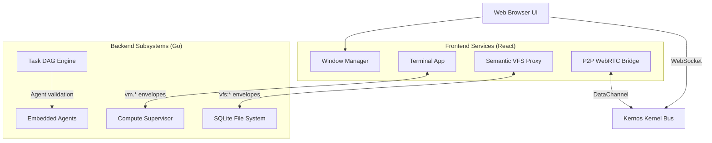

# Kernos OS
**The Browser-Native Cognitive Microkernel**

Kernos is an isomorphic, distributed operating environment designed to bridge the gap between local developer workstations and ephemeral cloud compute. By implementing a high-performance message-bus architecture over WebSockets, Kernos decouples the user interface (React/Vite) from the execution kernel (Go).

The result is a near-native desktop experience running entirely inside your browser, enhanced with deeply integrated AI agents that act as kernel-level services rather than bolted-on chatbots.

---

## 🚀 Quick Start

### Option 1: Docker (Zero Dependencies)
The easiest way to run the entire Kernos environment (Frontend + Backend) is via Docker:

```bash
docker run -p 8080:8080 -e KERNOS_API_KEY="your-llm-key" hanna/kernos:latest
```
Open `http://localhost:8080` in your browser.

### Option 2: Go Backend + Vite Dev Server
*Requires Node.js 22+ and Go 1.23+*

```bash
git clone https://github.com/your-username/kernos-os.git
cd kernos-os

# Start both frontend and backend concurrently
make dev
```
Open `http://localhost:3000` in your browser.

---

## 🏗️ Architecture

Kernos operates on a **Split-Kernel Architecture**. It uses a single JSON `Envelope` struct for all IPC across the system, routed via a central Message Bus lock-free channel system.



### Key Subsystems:

1. **The Envelope Protocol:** 100% of communication uses a typed envelope with `Topic`, `From`, `To`, and `Payload`. This makes the system profoundly extensible.
2. **Cognitive Task DAG:** Workflows aren't linear scripts. They are Directed Acyclic Graphs that must be signed off by the `Architect` AI agent before execution.
3. **P2P Collaboration:** Two Kernos kernels can bridge their busses over WebRTC Data Channels using a Zero-Trust 4-digit PIN exchange, allowing distributed terminal sharing.
4. **Speculative Execution:** A background shadow engine pre-executes your commands as you type in the editor, yielding 0ms latency terminal responses on cache hits.

---

## 🛡️ Security Model

Kernos is designed defensively. It assumes the browser is hostile and other P2P nodes are untrusted.

*   **Zero-Trust WebSocket Auth:** The UI must pass an ephemeral 32-byte CSRF token back through the socket within 3 seconds of connecting.
*   **VFS Sandboxing:** File operations are chroot-ed. Path traversal attempts (`../`) are blocked at the VFS middleware boundary.
*   **Execution Allowlist:** The internal `vm.spawn` supervisor only executes whitelisted, sanitized system commands (`git`, `node`, `echo`).
*   **P2P Topic Gating:** Remote WebRTC peers can only send envelopes targeting specific approved topics (e.g. `vfs.read`, but never `sys.register`).

---

## 🧬 Tech Stack

**Kernel (Backend):**
*   Go 1.23+
*   `gorilla/websocket` (IPC Bus)
*   `go-sqlite3` (Semantic Vector Store & Telemetry)

**Shell (Frontend):**
*   React 19 / TypeScript
*   Vite (Build & Dev)
*   Vitest / React Testing Library (Testing)
*   Zustand (State Management)
*   TailwindCSS (Styling)

---

*Copyright © 2026 Kernos Foundation. Open Source under Apache 2.0.*
